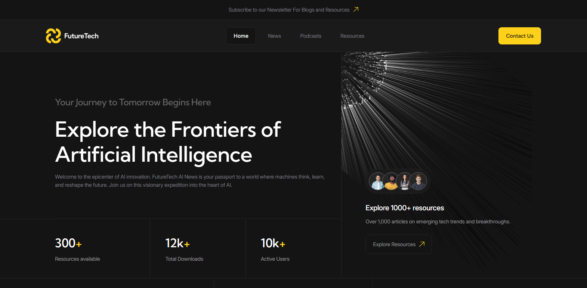

# Пет-Проект: сайт Future Tech

## Демо
[**Открыть проект**](https://kurohador001-lang.github.io/pet-project_future-tech/)

## :book: Описание:
Данный проект состоит из _6_ страниц и демонстрирует реализацию интерактивных UI-компонентов на **чистом JavaScript**, а также **BEM-структуру**, **accesibility** и **грамотную архитектуру**.
## :jigsaw: Реализованные компоненты

| Компонент | Описание |
|-----------|----------|
| **Интерактивный кастомный селект** | Полностью стилизованный выпадающий список с поддержкой клавиатуры и ARIA-атрибутов. |
| **Анимированный аккордеон** | Плавное раскрытие секций выполнено на чистом CSS |
| **Табы** | Переключение контента с клавиатурной навигацией |
| **Бургер-меню** | Мобильная навигация с оверлеем|
___

## :art: Дизайн
Макет Figma использован в качестве визуальной основы проекта.  
[**Перейти к макету**](https://www.figma.com/design/Mnx0Ji3CJD8SMu7lcyP3RP/FutureTech--Copy-?node-id=18-214&t=bQTCDFLM5PYiAj6L-1)  
### Список исправлений деталей макета:
  1. Размер шрифта на мобильных устройствах повышен с 14 до 16
  2. Кликабельная область бургер-кнопки увеличена до 40 пикселей вместо 30
  3. В форме выделены элементы, обязательные для заполнения

## :wrench: Стек технологий

  * HTML (HTML5)
  * CSS (CSS3), Sass (SCSS), Animations
  * JavaScript (ES6+, OOP)
  * BEM, Accessibility, UX
  * Git (GitHub)
  * Figma

## :rocket: Запуск проекта
1. Склонируй репозиторий: (введи в gitBash)  
git clone https://github.com/kurohador001-lang/pet-project_future-tech.git
2. Перейди в папку проекта
3. Открой в браузере файл index.html